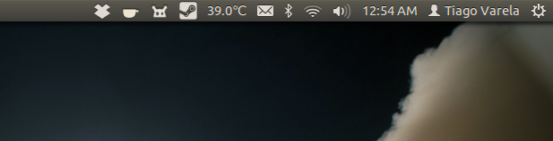

steam-mono-dark
===============

This is my attempt at using Inkscape to create a monochromatic
version of the steam logo to use on the ubuntu top panel.

The screenshot shows how it looks on the desktop.

the Steam logo is a registered trademark of Valve Corporation.
